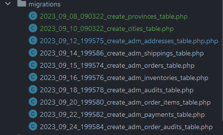
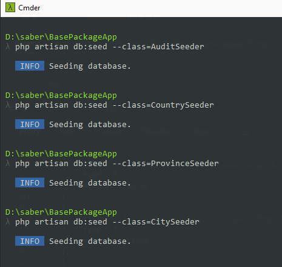
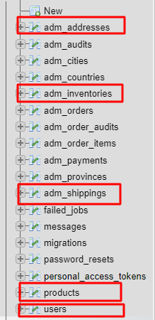
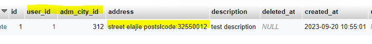
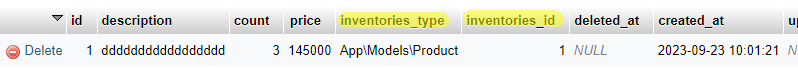
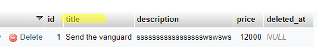

<div dir=rtl>

#Advancelearn manage-payment-order


[](https://packagist.org/packages/advancelearn/manage-payment-and-orders) [](https://packagist.org/packages/advancelearn/manage-payment-and-orders) [](https://packagist.org/packages/advancelearn/manage-payment-and-orders) [](https://packagist.org/packages/advancelearn/manage-payment-and-orders) [](https://packagist.org/packages/advancelearn/manage-payment-and-orders)

- [English documents](README.md)
- [داکیومنت فارسی](README-FA.md)


<a name="introduction"></a>

## مقدمه

این پکیج به همکاری با یکی از اعضای تیم Sadratech و AdvanceLearn توسعه داده شده است. هدف اصلی این پکیج ایجاد و مدیریت جنبه‌های مختلف مرتبط با سفارش‌ها و پرداخت‌های کاربر است. این شامل پیگیری تعداد محصولات و برچسب‌گذاری تمام مراحل سفارش خرید کاربر می‌شود. این پکیج در حال حاضر در دست توسعه فعال است و برنامه‌هایی برای افزودن یک ماژول کارت هدیه در آینده وجود دارد که منتظر پشتیبانی و امکان‌پذیری است.

با نصب این پکیج و در مراحل بعدی، جداول آدرس، کشور، استان، شهر، موارد سفارش، مراحل ثبت سفارش، هزینه ارسال سفارش، موجودی و قیمت، سفارش‌ها، پرداخت‌ها برای شما ایجاد می‌شود. و با کمک سیدر، می‌توانید برخی از جداول را پر کنید و به راحتی کشور ایران به همراه استان‌ها و شهرهای آن را در پایگاه داده خود داشته باشید.

<a name="installation"></a>

## نصب

شما می‌توانید این پکیج را با استفاده از Composer نصب کنید.

```bash
composer require advancelearn/manage-payment-and-orders
```

<a name="Config"></a>

## تنظیمات

پس از نصب، لطفاً پروایدر آن را به فایل تنظیمات در پوشه‌ی app اضافه کرده و پکیج را تکمیل و تنظیم کنید:

```php
\Advancelearn\ManagePaymentAndOrders\ManagePayOrderServiceProvider::class,
```

سپس این دستور را اجرا کنید تا جداول پکیج را وارد کنید و به عموم عرضه کنید:

```php
php artisan vendor:publish
```

شماره ردیف این عنوان را از بین تگ‌ها انتخاب کرده و وارد کنید:

```php
Tag: AdvanceLearnManagePayAndOrder-migrations ...............
```

#### با وارد کردن شماره تگ تصویر بالا، این جداول به پوشه‌ی جداول برنامه شما اضافه خواهند شد



سپس دستور زیر را وارد کنید تا جداول را در پایگاه داده‌ی خود اضافه کنید

```php
php artisan migrate
```

### حالا برای شروع مراحل مربوط به Audit در برنامه نیاز به دنبال کردن این مراحل دارید
```php
php artisan vendor:publish
```

شماره ردیف این عنوان را از بین تگ‌ها انتخاب کرده و وارد کنید

```php
Tag: AdvanceLearnManagePayAndOrder-seeds .....
```

دستورات را مطابق تصویر وارد کنید



مقدار مربوط به جدول مراحل سفارش را به پایگاه داده اضافه کنید تا بتوانید هنگام به روزرسانی بر اساس هر مرحله از سفارش مورد نظر از شناسه این مراحل استفاده کنید.

**_مهم_**

در مرحله بعد، شما باید مقادیر این سه جدول را برای کاربر و محصول خود تنظیم کنید (آدرس کاربر، مقدار مدلی که به عنوان محصول شناخته می‌شود و مقدار هزینه‌ها به دلیل نوع حمل و نقل)



این جدول ****`adm_addresses`**** مثال:



این جدول **_`adm_inventories`_** مثال:



این جدول **`adm_shippings`** مثال:



## ایجاد سفارش جدید توسط درخواست کاربر

"در مرحله اولیه، مهم است که توجه داشته باشیم که هدف ما ذخیره سفارش کاربر در سیستم است. برای دستیابی به این هدف، ما باید پارامترهای مورد نیاز را به متد 'store' پکیج خدمات سفارش ارسال کنیم. پس از اعتبارسنجی موفقیت‌آمیز این پارامترها، ما پاسخی حاوی جزئیات سفارش دریافت خواهیم کرد."

ما پارامترهای درخواستی از کاربر دریافت و ارسال می‌کنیم:
`$shippingId , $addressId , $description , $items`
**`__!!توجه کنید به نوع پارامترها که باید باشند__`**
```php
$items = [
    0 => [
        'quantity' => 1,
        "inventory_id" => 2
    ]
];
        
app('orderFunction')->store(int $shippingId, int $addressId, string $description, array $items);
#پارامترها :
# shippingId => نوع حمل و نقل,
# $addressId => شناسه آدرس ذخیره شده برای کاربر در جدول آدرس ,
# $description => ایجاد سفارش جدید توسط کاربر مثال .... ,
# $items =>  شماره سفارش محصول و شناسه موجودی متناظر مورد ورودی

```
### افزودن این متد به عنوان رابطه در مدل شما با موجودی

```php
public function inventories()
{
    return $this->morphMany(app('inventory'), 'adm_inventories');
}
```

### پس از افزودن رابطه:

"بعد از ادغام مدل شما با مدل موجودی، اجرای این قرارداد در مدل شما امری ضروری است. این به شما امکان انجام اقدامات مختلفی مانند ارسال ایمیل یا به‌روزرسانی مدل شما در فاز موفقیت‌آمیز پرداخت را می‌دهد. علاوه بر این، شما می‌توانید به‌راحتی موجودی مرتبط با رکورد فروخته شده در مدل خود را به‌روز کنید."

```php
use Advancelearn\ManagePaymentAndOrders\PaymentConfirmationInterface;

class Product extends Model implements PaymentConfirmationInterface
{
    // متدها یا منطق شما

    // پس از اجرای این متد، متد زیر را اضافه کنید:
    public function paymentConfirmation($user_id, $inventory_id, $quantity)
    {
        // منطق اضافه شده شما بعد از paymentConfirmation
    }
}

```

"اکنون در فاز ایجاد سفارش جدید سفارشی ایجاد کرده‌اید، بنابراین برای هدایت کاربر به دروازه پرداخت، باید این شناسه سفارش را به این متد ارسال کنید، می‌توانید بررسی کنید که مقدار سفارش پرداخت شده است یا خیر. در صورت عدم پرداخت، می‌توانید کاربر را به دروازه پرداخت هدایت کنید."

در کلاس خود این نیم‌اسپیس را اضافه کنید:

```php
use Advancelearn\ManagePaymentAndOrders\Enums\AuditTypes;
```

```php
$order = app('order')::findOrFail($orderId);

if ($order->audits->where('id', AuditTypes::PAID)->count()) {
    return response()->json(['errors' => 'قبلاً پرداخت شده است'], 422);
}
```

و در نهایت، مبلغ نهایی سفارش را برای ارسال به دروازه پرداخت ارسال کنید:

```php
$invoice = new Invoice;

$invoice->amount($order->payment_price);
```

و در همان متدی که کاربر به دروازه پرداخت ارسال شد، می‌توانید یک پرداخت برای کاربر با وضعیت در انتظار ایجاد کنید:

```php
 app('payment')::create
 ([
    'order_id' => $order->id,
    'driver' => $request->input('driver'),
    'transaction_id' => //transactionId از درخواست ارسالی دروازه پرداخت خود برای پرداخت,
    'amount' => $order->payment_price
]);
```

و به عنوان مثال، در متد بازخوردی که از دروازه پرداخت برگشته است (فرض کنید که متد بازخورد شما با نام paymentConfirmation فراخوانی می‌شود):

```php
    public function paymentConfirmation(Request $request)
    {
        $payment = app('payment')::where('transaction_id', $transactionId)->first();
        $order = app('order')::find($payment->order_id);
         $receipt = //تماس با دروازه برای تأیید پرداخت و دریافت پاسخ و اضافه کردن به این متغیر
        $this->verifyPayAndConfirm($payment, $order, $request);
//          return redirect('https://example.com?gatewayOrderID=' .
//           $paymentTransaction->OrderId ?? null . '&RRN=' .
//           $paymentTransaction->RRN ?? null);
    }
```

متد فراخوانی برای ایجاد:
در کلاس خود این نیم‌اسپیس را اضافه کنید:

```php
use Advancelearn\ManagePaymentAndOrders\Enums\AuditTypes; 
```

```php
    private function verifyPayAndConfirm($receipt, $payment, Request $request): void
    {
        $payment->reference_id = $receipt->getReferenceId();
        $payment->transaction = $request->all();
        $payment->driver = $receipt->getDriver();
        $payment->save();
        $order->audits()->attach([AuditTypes::PAID => ['description' => 'پرداخت با موفقیت انجام شد']]);
        foreach ($order->items as $item) {
            // این متد از رویایی تا اینجا فراخوانی می‌شود
            // تا برسد به متدی که در مدل مربوطه از رابط ایجاد کرده‌ایم
            $item->PaymentConfirmation($order->address->user_id);
        }
        return $receipt;
    }
```

## وضعیت پرداخت

شما می‌توانید وضعیت سفارشاتی که توسط بررسی هر مرحله که وضعیت جدید باید ثبت شود، را پایش کنید. شما می‌توانید یک رکورد مرتبط با مرحله فعلی سفارش اضافه کنید و می‌توانید به شناسه مراحل از جدول adm_audits مراجعه کنید.

**شما می‌توانید این متد را برای دریافت تمام اطلاعات مربوط به سفارش‌های خود فراخوانی کنید**
```php
$paginateCount = 6;
app('orderFunction')->getOrders($paginateCount);
```
**از این متد برای نمایش اطلاعات فردی یک سفارش استفاده کنید**
```php
app('orderFunction')->show($order);
```
**توجه به نوع پارامترها**
**شما می‌توانید از این متد برای به‌روزرسانی یک سفارش استفاده کنید**
شما می‌توانید یک رکورد جدید در جدول adm_shippings برای انواع مراحل حمل و نقل و قیمت‌هایی که باید برای حمل و نقل محاسبه شوند، ایجاد کنید و شناسه آن را برای محاسبه در متد store یا update ارسال کنید. به این مثال توجه کنید.
```php
$shippingId = app('shipping')::find(1)->pluck('id')->first();
```
```php
 $auditId = app('audit')::find(2)->toArray();
 $items = [
    0 => [
        'quantity' => 1,
        "inventory_id" => 1
    ]
];
$updateOrder = app('orderFunction')->update(int $shippingId, int $addressId, string $description, string $shippingDate, array $items, int $audit, int $orderId);

return $updateOrder;
#پارامترها => shippingId , $addressId , $description , $shippingDate , $items , $auditID , $orderId
```
**مهم**
یادآوری کنید که شناسه آدرسی که برای

به‌روزرسانی وارد می‌کنید باید به **_`کاربری که خرید را انجام داده`_** مرتبط باشد، زیرا ما از طریق آدرس در کدها به کاربر دسترسی داریم.
**شما می‌توانید از این متد برای لغو سفارش توسط کاربر استفاده کنید**
```php
 $delete =  app('orderFunction')->destroyByUser($orderId);
 return $delete;
```
**شما می‌توانید از این متد برای لغو سفارش توسط مدیر استفاده کنید**
```php
  $delete =  app('orderFunction')->destroyByAdmin($orderId);
  return $delete;
```
شما می‌توانید با استفاده از این متدها و ارسال پارامترهای مورد نیاز، لیست سفارش‌ها و پرداخت‌ها را برای مدیر و کاربری که وارد شده است نمایش دهید.

## دریافت لیست سفارش‌ها یا یک سفارش تکی
```php
        return app('orderFunction')->getOrders(); // دریافت لیست سفارش‌ها برای پنل مدیریت
        return app('orderFunction')->singleOrder(5); // دریافت یک سفارش تکی برای پنل مدیریت

        return app('orderFunction')->ordersOfTheLoggedInUser(); // دریافت لیست سفارش‌های کاربر وارد شده
        return app('orderFunction')->SingleOrderOfTheLoggedInUser(5); // دریافت یک سفارش تکی کاربر وارد شده
```

## دریافت لیست پرداخت‌ها یا یک پرداخت تکی
```php
       return app('paymentFunction')->getPayments(); // دریافت لیست پرداخت‌ها برای پنل مدیریت

       return app('paymentFunction')->singlePayment(1); // دریافت یک پرداخت تکی برای پنل مدیریت

       return app('paymentFunction')->paymentsOfTheLoggedInUser(); // دریافت لیست پرداخت‌های کاربر وارد شده

       return app('paymentFunction')->SinglePaymentsOfTheLoggedInUser(1); // ارسال شناسه پرداخت ($paymentId)
```

## به یادداشته باشید

زمانی که یک کاربر از مدل User شما استفاده می‌کند و شما روابط Address را برای این کاربر تعریف کرده‌اید، پس از ایجاد یک حساب کاربری جدید در سیستم، با کمک AdmUserObserve در بستهٔ خود، یک آدرس دیجیتال برای کاربر در سیستم ایجاد می‌شود. به این ترتیب، اگر کاربر مایل به خرید محصولات غیرفیزیکی باشد که نیازی به هزینه ارسال ندارند، ما یک آدرس تحویل دیجیتالی در سیستم برای او ایجاد می‌کنیم.

<a name="conclusion"></a>

## نتیجه‌گیری
با استفاده از این پکیج، نیازی به ایجاد مدل‌های جداگانه برای فرآیند سفارش و پرداخت ندارید. علاوه بر این، این امکان را فراهم می‌کند تا تاریخچه اطلاعات کاربر و مدیریت این رکوردها را ارائه دهد. به عنوان مثال، شما می‌توانید اقداماتی مانند به‌روزرسانی وضعیت سفارش به انواع و بخش‌های مختلف، سازماندهی مراحل سفارش (مانند ارسال محصولات، لغو سفارش، ثبت نهایی، آماده‌سازی برای حمل و نقل) و موارد دیگر را در یک چارچوب یکپارچه انجام دهید.


</div>
