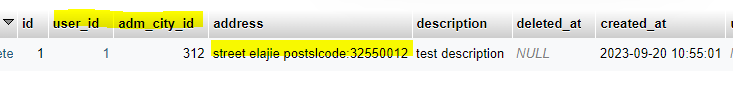
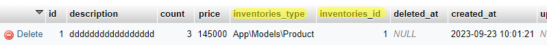
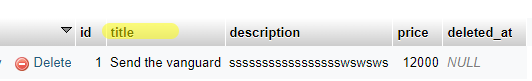

# Advancelearn manage-payment-order


<a name="introduction"></a>

## Introduction

This package was developed in collaboration with a Sadratek team member and AdvanceLearn. This package aims to create
and manage various aspects related to user orders and payments. It includes tracking the number of products and tagging
all steps of the user's purchase order." This package is currently under active development and there are plans to add a
shopping voucher module in the future, pending support and feasibility.

<a name="installation"></a>

## Installation

You can install the package with Composer.

```bash
composer require advancelearn/manage-payment-and-orders
```

<a name="Config"></a>

## Config

After installation, please add its provider to your config folder in the app file to complete and configure the package:

```php
 \Advancelearn\ManagePaymentAndOrders\ManagePayOrderServiceProvider::class,
```

Then run this command to import and make the package tables public

```php
php artisan vendor:publish
```

Select the row number of this title from among the tags and enter it

```php
  Tag: AdvanceLearnManagePayAndOrder-migrations ...............
```

#### By entering the tag number of the image above, these tables will be added to the tables folder of your program


Then enter the following command to add tables in your database


```php 
php artisan migrate
```


**_Important_**

In the next step, you have to set the values of these three tables for your user and your product (the user's address, the amount of the model that will be known as the product, and the amount of costs due to the type of shipment)


this table ****`adm_addresses`**** example:



this table **_`adm_inventories`_** example:




this table **`adm_shippings`** example:




##Create new Order By User Request
"In the initial step, it's important to note that we aim to store a user's order within the system. To achieve this, we need to send the required parameters to the 'store' method of the order service package. Upon successful validation of these parameters, we will receive a response containing the order details."
We receive and send the requested parameters from the user:
`$shippingId , $addressId , $description , $items`
**`__!!Pay attention to the type of parameters that they should be__`**
```php
app('orderFunction')->store(int $shippingId, int $addressId, string $description, array $items);
```
####example `$items` for passed to params:
For each model that is supposed to be able to be sold, a record must be created for it in the inventories table so that the warehouse quantity management of that model is also entered in that section, and after successful payment, a number is deducted from the number of models in that table. to be
```php
        $items = [
            0 => [
                'quantity' => 2,
                "inventory_id" => 1
            ]
        ];
        $newOrder = app('orderFunction')->store(1, 1, "test from create new order",$items);
```

### add this method for Relationship in your model with Inventory

```php
    public function inventories()
    {
        return $this->morphMany(app('inventory'), 'adm_inventories');
    }

```
### After add RelationShip:

"After integrating your model with the inventory model, it is essential to implement this contract within your model. This allows you to execute various actions, such as sending emails or updating your model, during the successful payment phase. Additionally, you can seamlessly update the Inventory associated with the sold record in your model."


```php
use Advancelearn\ManagePaymentAndOrders\PaymentConfirmationInterface;

class Product extends Model implements PaymentConfirmationInterface
{
    //you're methods or logic
    
    //added this method after implemention:
    public function paymentConfirmation($user_id, $inventory_id, $quantity)
    {
        //you're added logic after paymentConfirmation
    }
}

```

"Now you have created a new order in the order creation phase, so to redirect the user to the payment gateway, you need to send this order id to this method, you can check whether the order amount has already been paid or not. In case of non-payment, you can redirect the user to the payment gateway."

write this namespace in your class:
```php
use Advancelearn\ManagePaymentAndOrders\Enums\AuditTypes; 
```
```php
$order = app('order')::findOrFail($orderId);

if ($order->audits->where('id', AuditTypes::PAID)->count()) {
    return response()->json(['errors' => 'Already paid'], 422);
}
    
```

And finally, send the final order amount to send to the portal:

```php
$invoice = new Invoice;

$invoice->amount($order->payment_price);
```

And in the same method that the user was sent to the payment portal, you can create a payment for the user with a
pending status:

```php
 app('payment')::create
 ([
    'order_id' => $order->id,
    'driver' => $request->input('driver'),
    'transaction_id' => //transactionId from your gateway sent request for pay,
    'amount' => $order->payment_price
]);
```


And for example, in your callback method that returns from the portal, let's assume that your callback method is called
paymentConfirmation.

```php
    public function paymentConfirmation(Request $request)
    {
        $payment = app('payment')::where('transaction_id', $transactionId)->first();
        $order = app('order')::find($payment->order_id);
         $receipt = //api call gateway for verifyPayment and get response add to this variable
        $this->verifyPayAndConfirm($payment, $order, $request);
//          return redirect('https://example.com?gatewayOrderID=' .
//           $paymentTransaction->OrderId ?? null . '&RRN=' .
//           $paymentTransaction->RRN ?? null);
    }
```

create call method verifyPayAndConfirm::

```php
    private function verifyPayAndConfirm($receipt, $payment, Request $request): void
    {
        $payment->reference_id = $receipt->getReferenceId();
        $payment->transaction = $request->all();
        $payment->driver = $receipt->getDriver();
        $payment->save();
        $order->audits()->attach([app('auditTypes')::PAID => ['description' => 'Payment was successful']]);
        foreach ($order->items as $item) {
            //this method called fromAnd finally, this
            // method reaches the method that we implemented
            // in the corresponding model of the interface 
            $item->PaymentConfirmation($order->address->user_id);
        }
        return $receipt;
    }
```
##Payment status

You can monitor the status of orders that have been prepared by checking each step where the new status should be documented. You can add a record related to the current stage of the order and you can reference the stage IDs from the adm_audits table.


**You can call this method to get all the information about your orders**
```php
$paginateCount = 6;
app('orderFunction')->getOrders($paginateCount);
```
**Use this method to display individual information of an order**
```php
app('orderFunction')->show($order);
```
####Pay attention to the type of parameters
####You can use this method to update an order
You can create a new record in the adm_shippings table for the types of shipping steps and prices that must be calculated for shipping, and send its ID for calculation in the store or update method. Pay attention to this example.
```php
$shippingId = app('shipping')::find(1)->pluck('id')->first();
```
```php
 $auditId = app('audit')::find(2)->toArray();
 $items = [
    0 => [
        "id" => 1,
        "price" => 145000,
        'quantity' => 1,
        "inventory_id" => 1
    ]
];
app('orderFunction')->update(int $shippingId, int $addressId, string $description, string $shippingDate, array $items, int $audit, int $orderId);
#params => shippingId , $addressId , $description , $shippingDate , $items , $auditID , $orderId
```
##Important
Remember that the address ID you enter for updating must be related to **_`the user who made the purchase`_**, because we reach the user from the address in the codes.
####You can use this method to cancel the order By User
```php
 $delete =  app('orderFunction')->destroyByUser($orderId);
 return $delete;
```
####You can use this method to cancel the order By Admin
```php
  $delete =  app('orderFunction')->destroyByAdmin($orderId);
  return $delete;
```


<a name="conclusion"></a>

## Conclusion
By utilizing this package, there is no need to create separate models for the order and payment processes. Moreover, it allows for the presentation of user information history and the management of these records. For instance, you can perform actions like updating the order status to various types and sections, organizing the order stages (e.g., sending the products, order cancellation, final registration, readiness for shipment), and more—all within a unified framework.


